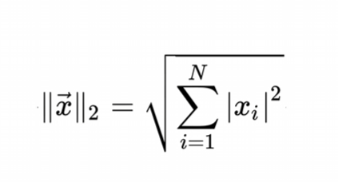
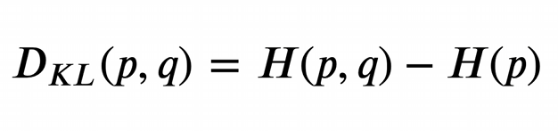

# 基础数学知识概览


## 线性代数
### 标量
> 一个简单的数
```
a = 1.0
b = 5
```
### 向量 
> 一个向量表示一组有序排列，并可以通过索引获取其中对应位置的数值

向量与标量运算
```
import numpy as np

a = np.array([1, 2, 3, 4])
print(a * 4)
# Get arrag([4, 8, 12, 16])
print(a + 4)
# Get array([5, 6, 7, 8])
```
向量之间的加减
```
x = [1, 2, 3]
y = [4, 5, 6]
print(x + y)
# Get: [1, 2, 3, 4, 5, 6]

import numpy as np
print(np.add(x,y))
# Get: array([5, 7, 9])
```
点乘(内积、数量积)
> 点乘的结果是标量, 要求两个向量长度一致
```
import numpy as np

a = np.array([1,0,0])
b = np.array([0,1,0])
np.dot(a,b) # 向量a和向量b相互垂直，其点积为0

```
叉乘(外积、向量积)
> 结果也是向量


对应项相乘(*乘)
> 两个向量对应位置相乘，得到的还是原来的形状
```
a = np.array([1,2,3])
b = np.array([2,4,6])
对应项相乘
# a * b => [1*2, 2*4, 3*6]
```


### 矩阵
矩阵加法（对应位置相加减）

```
import numpy as np
a = np.mat(((1,2),(5,6)))
b = np.mat(((0,1),(2,3)))
# a + b => matrix([[1,3],[7,9]])
```
矩阵乘法
形状相同的矩阵：对应位置直接相乘
不相同：

```
import numpy as np
a = np.array([[1,2],[3,4]])
b = np.array([[5,6],[7,8]])
# a.dot(b) => array([[19,22],[43,50]])
```


### 张量

### 范数
范数是一种距离的表示（曼哈顿距离），或者说是向量的长度。用于权值稀疏。

L0范数，指这个向量中非0元素的个数

> 可以通过L0范数减少非0元素的个数，从而减少参与决策的特征，减少参数

L1范数，指的是向量中所有元素的绝对值之和，它也被称为稀疏规则算子


为什么要实现权值稀疏？

> 在设计模型的过程中，我们有时候会用到大量的特征，有一部分特征对我们最后的结果贡献非常的小，甚至接近于0，我们希望将其舍弃。更方便模型做出决策


L2范数(岭回归，权值衰减)，指所有元素平方和开根
> L2范数也代表一种距离，欧式距离。作用于避免过拟合。



越小的参数，模型越简单，越简单的模型，就越不容易过拟合。
想要让L2小，则需要，让向量中的每一个元素的平方都尽量接近0。

## 微积分

### 导数

导数：斜率


偏导数（多维，不同方向的斜率）


梯度（所有偏导数构成的向量）
> 梯度是一个方向，梯度向量的方向，即为函数值增长最快的方向


## 信息论
信息论集成了微积分，概率论，和统计学中的很多概念和想法。
比较经典的决策树，就是一个例子。

### 熵

信息熵
> p(xi)就是各个可能事件的发生概率，熵越大，不确定性越大


KL散度，相对熵
> p(xi)为各个可能事件的发生概率，q(xi)为理论拟合出来的该事件的概率分布。当拟合事件于真实事件一致的时候，KL散度为0，不一样的时候会大于0


交叉熵
> 用拟合分布来表示实际分布的困难程度


关联


