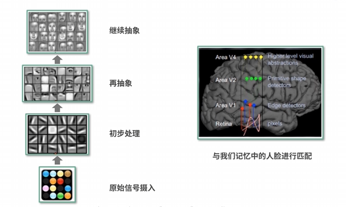
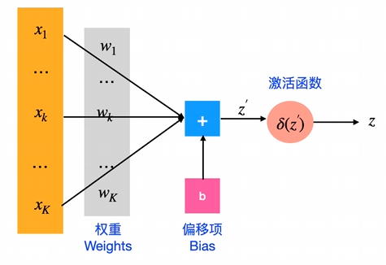
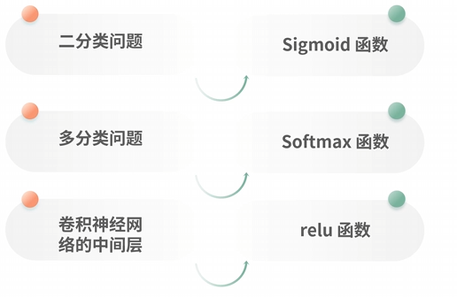
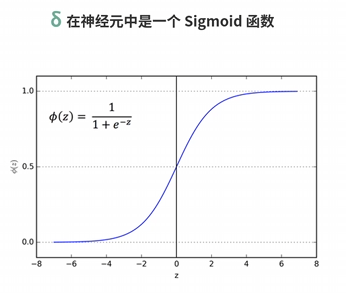
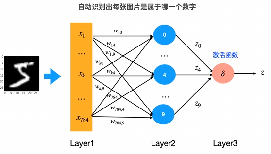
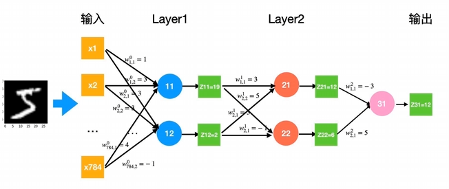
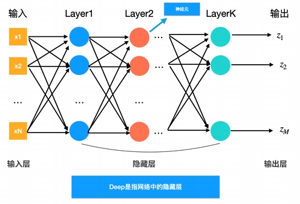

## 深度学习的起源

1950年，人工智能

1980年，机器学习

2010年，深度学习

人类视觉系统是这个世界上最为神奇的一个系统。1981年的诺贝尔医学奖得主David H.Hubel 和Torsten Wiesel的研究表明：即人脑视觉机理，是指视觉系统的信息处理在可视皮层是分级的，大脑的工作过程是一个不断迭代、不断抽象的过程。视网膜在得到原始信息后，首先经由区域V1初步处理得到边缘和方向特征信息，其次经由区域V2的进一步抽象得到轮廓和形状特征信息，如此迭代地经由更多更高层的抽象最后得到更为精细的分类。

### 神经元与感知机

深度学习的算法，基本上都是一层一层的网络结构，我们把这种网络称之为【人工神经网络】

神经元

x1,x2...xk为输入
w1,w2...wk为训练出来的权重，也叫参数

偏移量用于避免除0，激活函数用于避免梯度爆炸或消失

激活函数

Sigmoid函数，将值约束在0~1之间

Softmax函数，用于多分类，将输出约束在0~1之间，同时所有值的和为1

多层感知机，最基本简单的神经网络
> 多层感知机模仿人的神经系统，将获得的信息一层层的传递下去，每一层做不同的抽象

神经元的局限，只能学习到线性的，无法解决一些复杂的非线性问题，参数量膨胀（全连接层），梯度消失（Sigmoid函数）