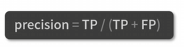

# 专业术语

### 训练：
深度学习中有很多的算法，每种算法都有自己模型结构的结构，还需要知道结构当中的参数。

确定一个模型当中参数的过程，就称之为训练。

训练是一个迭代的过程，模型一般会遍历训练集很多遍。

### 训练集：
训练过程中使用的数据

训练集的数据质量**决定**了模型的质量。

### Epoch
遍历一遍训练数据，叫做“一个Epoch”

模型训练的Epoch数必须要让模型达到一个收敛的状态。通常会在训练到收敛状态后，进行筛选。

### Batch Size
- 每次用到一定量的数据，叫做“一个Batch”
- 每个Batch中的数据个数，无论多少，都统称为“Batch Size”

模型学习是一个迭代的过程，我们通常不会直接将训练集的所有数据同时丢给模型。

> 相当于于一次学习一部分，一次学习的量就是Batch Size

### Step
每一次取数据我们称之为“一个Step”或者“一个Iterator”
一个Epoch中，Step的等于数据总量除以Batch Size

### 测试集
在训练的过程中，我们会经历一部分训练就保存模型

测试集是我们模拟实际要解决问题的内容。通常，我们会将数据集划分为80%的训练集，20%为测试集。

### 有监督学习

 常见的分类问题。在有监督学习中，它的训练集是需要标注好的。

标注好的数据，相当于教材。

### 无监督学习

在没有额外信息的情况下，自动提取数据中模式的结构。例如聚类。GAN，自编码器。

### 评估指标

### 混淆矩阵

### 准确率

这种方式针对于各类别比较平均的情况

### 精确率

### 召回率

### F1-Score
根据精确率和召回率来计算的

### 均方误差
越小，则越接近于真实。

