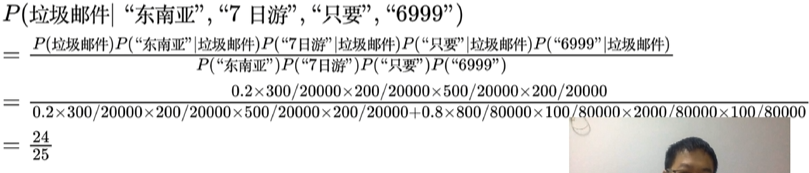

# 朴素贝叶斯

## 问题案例

问题：垃圾邮件识别

贝叶斯定理：
**支持某项属性的事件发生得愈多，则该属性成立的可能性就愈大**

贝叶斯分类器是一种生成式模型，通过计算概率来进行分类，可以用来处理多分类问题，对于小规模的数据预测，同样表现良好。

贝叶斯分类器适合多分类任务，适合增量式训练，对于大规模数据，计算复杂度较低，同时算法原理比较简单易懂。但缺点是，对输入数据比较敏感，而且贝叶斯分类器是假设特征之间相互独立，而往往实际例子中特征之间都有相互联系，所以对于特征之间相关性较强的运用场景，准确率上会有一定损失；并且连续型的特征是假设该特征满足高斯分布，同样会带来一定准确率上的损失。

## 实战
对10000封邮件进行标注，其中正常邮件占80000，垃圾邮件20000。

例：
- 邮件信息：东南亚7日游只要6999。

将其分词为："东南亚"/"7日游"/"只要"/"6999" 四个词，在全量的邮件信息中，统计这些词存在于正常邮件和垃圾邮件当中的概率。

| 次数统计 | 正常邮件 | 垃圾邮件 |
| -------- | -------- | -------- |
| "东南亚" | 800      | 300      |
| “7日游"  | 100      | 200      |
| "只要"   | 2000     | 500      |
| "6999"   | 100      | 200      |

