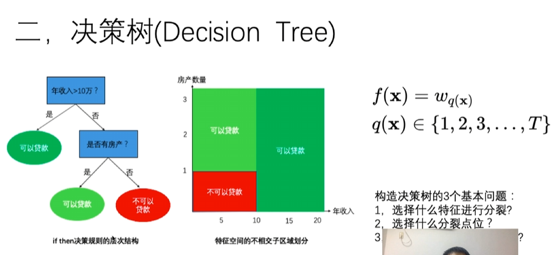

# 决策树

## 问题案例

信贷风险问题
- 数据集的特点：有些特征非常重要(如收入)，有些特征价值较小(如星座)

| 姓名   | 性别 | 年龄 | 星座   | 年收入 | 房产数 | 是否逾期 |
| ------ | ---- | ---- | ------ | ------ | ------ | -------- |
| 喵老板 | 男   | 23   | 摩羯座 | 100    | 0      | 是       |
| 老板喵 | 男   | 33   | 水瓶座 | 648    | 10     | 否       |
| 咬人喵 | 女   | 20   | 狮子座 | 233    | 3      | 否       |

